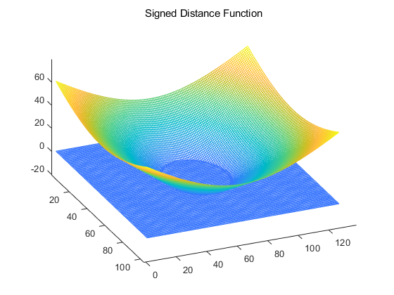
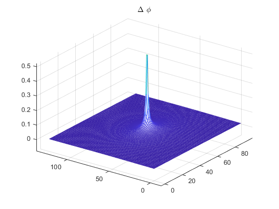

# 水平集图像分割

## 1. 水平集变分推导

能量函数：
$$
\varepsilon_{g,\lambda,\nu} = \lambda\mathcal{L}(\phi)+\nu\mathcal{A}_g(\phi)
$$
其中：
$$
\mathcal{L}_g=\int_{\Omega}g\delta(\phi)|\nabla\phi|dxdy,\qquad \mathcal{A}_g=\int_{\Omega}gH(-\phi)dxdy,\qquad g=\frac{1}{1+|\nabla G_{\sigma}*I|}
$$
水平集的优化目标是求得使其能量函数$\varepsilon_{g, \lambda, \nu}$能量最小的曲面$\phi$，即
$$
\phi^*=\arg \min(\varepsilon_{g,\lambda,\nu})=\arg \min (\lambda\mathcal{L}(\phi)+\nu\mathcal{A}_g(\phi))
$$
使用变分法对其进行求解：

**首先来看第一项：**
$$
\mathcal{L}_g=\int_{\Omega}g\delta(\phi)|\nabla\phi|dxdy
$$
令$F(\phi)=g\delta(\phi)|\nabla\phi|$， 取一个很小的$\varepsilon$和一个随机函数$h$，满足$h|_{\partial \Omega}=0$，则
$$
\begin{aligned}
F(\phi+\varepsilon h)&=g\delta(\phi+\varepsilon h)|\nabla(\phi+\varepsilon h)| \\
&=g\delta(\phi+\varepsilon h)\sqrt{(\phi + \varepsilon h)_x^2+(\phi+\varepsilon h)_y^2}
\end{aligned}
$$
对偏移量$\varepsilon$进行求导：
$$
\frac{\partial F(\phi+\epsilon h)}{\partial \varepsilon}=gh\delta '(\phi+\varepsilon h)|\nabla(\phi+\varepsilon h)| + g\delta (\phi+\varepsilon h)\frac{h_x(\phi+\varepsilon h)_x + h_y(\phi+\varepsilon h)_y}{\sqrt{(\phi+\varepsilon h)_x^2+(\phi+\varepsilon h)_y^2}}
$$

$$
\frac{\partial F(\phi+\epsilon h)}{\partial \varepsilon}\bigg |_{\varepsilon\rightarrow0}=gh\delta '(\phi)|\nabla(\phi)| + g\delta (\phi)\frac{h_x(\phi)_x + h_y(\phi)_y}{\sqrt{(\phi)_x^2+(\phi)_y^2}}
$$

所以
$$
\frac{\partial \mathcal{L_g}(\phi+\varepsilon h)}{\partial \varepsilon}\bigg |_{\varepsilon\rightarrow0}=\int_{\Omega}gh\delta'(\phi)|\nabla\phi|dxdy+\int_{\Omega}g\delta(\phi)\frac{h_x\phi_x+h_y\phi_y}{\phi^2_x+\phi^2_y}dxdy
$$
其中，$\delta(\phi)=1~if~\phi=0~else~0$，因此式(7)中的第一项为零，式(7)可以进行进一步简化
$$
\begin{aligned}
\frac{\partial \mathcal{L_g}(\phi+\varepsilon h)}{\partial \varepsilon}\bigg |_{\varepsilon\rightarrow0}
&=\int_{\Omega}g\delta(\phi)\frac{h_x\phi_x+h_y\phi_y}{\phi^2_x+\phi^2_y}dxdy\\
&=\int_{\Omega}\left[ \frac{\partial}{\partial x}(\frac{\phi_xg\delta(\phi)h}{|\nabla \phi|})+\frac{\partial}{\partial y}(\frac{\phi_y g\delta(\phi)h}{|\nabla \phi|})\right]dxdy
-\int_{\Omega} \left[ \frac{\partial}{\partial x}(\frac{\phi_x g \delta(\phi)}{|\nabla \phi|})h+\frac{\partial}{\partial x}(\frac{\phi_y g \delta(\phi)}{|\nabla \phi|})h \right]dxdy\\
&=\mathcal{L}_{g1}+\mathcal{L}_{g_2}
\end{aligned} \tag{7.1}
$$
由格林公式：
$$
\oint (Sdx+Rdy) = \iint_{\Omega}(\frac{dS}{dx}-\frac{dR}{dy})dxdy
$$
则式(7.1)中的第一项$\mathcal{L}_{g1}$可以转化为：
$$
\begin{aligned}
\mathcal{L}_{g1}&=\int_{\Omega}\left[ \frac{\partial}{\partial x}(\frac{\phi_xg\delta(\phi)h}{|\nabla h|})+\frac{\partial}{\partial y}(\frac{\phi_y g\delta(\phi)h}{|\nabla h|})\right]dxdy\\
&=\oint h(g\delta(\phi)\phi_xdy-g\delta(\phi)\phi_ydx)\\
&=0\quad (\because h|_{\partial\Omega}=0)
\end{aligned}
$$
所以
$$
\begin{aligned}
\frac{\partial \mathcal{L_g}(\phi+\varepsilon h)}{\partial \varepsilon}\bigg |_{\varepsilon\rightarrow0}
&=
-\int_{\Omega} \left[ \frac{\partial}{\partial x}(\frac{\phi_x g \delta(\phi)}{|\nabla \phi|})h+\frac{\partial}{\partial x}(\frac{\phi_y g \delta(\phi)}{|\nabla \phi|})h \right]dxdy\\
&=-\int_{\Omega}h \text{div}(\frac{\nabla\phi g \delta(\phi)}{|\nabla \phi|})dxdy
\end{aligned} \tag{7.2}
$$
当给定x, y时，$\nabla \phi$是向量，$g, \delta$都是标量，因此：
$$
\begin{aligned}
h\text{div}(\frac{\nabla\phi g \delta(\phi)}{|\nabla \phi|})
&= h\left[ \frac{\nabla \phi}{|\nabla \phi|}\nabla(g\delta(\phi))+\text{div}(\frac{\nabla \phi}{|\nabla \phi|})g\delta(\phi) \right]\\
&= h\left[ \frac{\nabla \phi}{|\nabla \phi|}(\nabla g \cdot\delta(\phi)+g\delta'(\phi)\nabla\phi)+div(\frac{\nabla \phi}{|\nabla \phi|})g\delta(\phi) \right]
\end{aligned}
$$
因为$h\frac{\nabla \phi}{|\nabla \phi|}g\delta'(\phi)\nabla\phi=0$，有
$$
h\text{div}(\frac{\nabla \phi g \delta(\phi)}{|\nabla \phi|})=h[\frac{\nabla \phi}{|\nabla \phi|}\nabla g\delta(\phi)+\text{div}(\frac{\nabla \phi}{|\nabla \phi|})g\delta(\phi)]=h\delta(\phi)\text{div}(\frac{\nabla \phi g}{|\nabla \phi|})
$$
当$\mathcal{L}_g$取最小值时，$\frac{\partial \mathcal{L_g}(\phi+\varepsilon h)}{\partial \varepsilon}\bigg |_{\varepsilon\rightarrow0}=0$，由于$h$取得是任意函数，所以得
$$
\delta(\phi)\text{div}(\frac{\nabla \phi g}{|\nabla \phi|})=0
$$

**再看第二项：**
$$
\mathcal{A}_{g}=\int_\Omega{gH(-\phi)dxdy}，H是阶跃函数
$$
令$F(\phi)=gH(-\phi)$，同理进行一个小的偏移量$\varepsilon h$，其中$h$是任意得函数，且 $h|_{\partial \Omega}=0$，则：
$$
F(\phi+\varepsilon h)= gH(-\phi-\varepsilon h)
$$

$$
\frac{\partial F(\phi + \varepsilon h)}{\partial \varepsilon}=-gh\frac{\partial}{\varepsilon}(H(-\phi-\varepsilon h))=-gh\delta(-\phi-\varepsilon h)=-gh\delta(\phi+\varepsilon h)
$$

因此：
$$
\frac{\partial F(\phi + \varepsilon h)}{\partial \varepsilon}\bigg|_{\varepsilon\rightarrow0}=-gh\delta(\phi)
$$

$$
\frac{\partial \mathcal{A}_g(\phi + \varepsilon h)}{\partial \varepsilon}\bigg|_{\varepsilon \rightarrow0}=-\int_{\Omega}gh\delta(\phi)dxdy
$$

当$\mathcal{A}_g$取最小值时，有$\frac{\partial \mathcal{A}_g(\phi + \varepsilon h)}{\partial \varepsilon}\bigg|_{\varepsilon \rightarrow0}=0$，由于$h$为任意函数，故：
$$
g\delta(\phi)=0
$$

**综合式(10)和式(16)，可以导出水平集的演化方程为：**
$$
\frac{\partial \phi}{\partial t}=\lambda\delta(\phi)\text{div}(g\frac{\nabla\phi}{|\nabla\phi|})+\nu g\delta(\phi)
$$

## 2. 基于水平集的图像分割

任务：利用如下演化方程，用matlab代码实现图像分割：
$$
\frac{\partial \phi}{\partial t}=\mu[\Delta\phi - \text{div}(\frac{\nabla\phi}{|\nabla \phi|})]+\lambda\delta(\phi)\text{div}(g\frac{\nabla\phi}{|\nabla \phi|})+\nu g\delta(\phi)\\
g = \frac{1}{1+|\nabla G_\sigma * I|^2},\quad
\delta_{\varepsilon}(x)=
\left\{
	\begin{array}{**lr**}
	0, & |x| \gt \varepsilon \\
	\frac{1}{2\varepsilon}[1+cos(\frac{\pi x}{\varepsilon})], & |x| \le \varepsilon
	\end{array}
\right.
$$

### 2.1 原理

一个曲面的能量可以由以下变分能量函数进行定义：
$$
\varepsilon(\phi)=\mu \mathcal{P}(\phi)+\varepsilon_{g, \lambda, \nu}(\phi)
$$
其中
$$
\mathcal{P}(\phi) = \int_\Omega \frac{1}{2}(|\nabla \phi-1)^2dxdy\\
\varepsilon_{g,\lambda,\nu}(\phi) = \lambda\mathcal{L}(\phi)+\nu\mathcal{A}_g(\phi)
$$
$\mathcal{P}$限制曲面尽可能光滑（类似于正则项），$\varepsilon_{g, \lambda, \nu}$限制曲面尽可能向边缘处逼近，通过这两项的权衡，找到使得形成这个平面最小的能量函数对应的曲面。

### 2.2 各项物理含义

要在提供的水平集代码基础上修改，首先需要理清式(18)中各项的物理含义。

#### $\phi$

首先来看变量$\phi$，这是定义的符号距离函数。
$$
\phi(x, t)=
\left\{
	\begin{array}{**lr**}
	< 0, & x \in \Omega \\
	= 0, & x \in \partial \Omega \\
	> 0, & x \notin \Omega
	\end{array}
\right.
$$
其中，t表示时间， x是水平集设计变量， $\phi$是水平集函数，$\Omega$是作用域（感兴趣区域），$\partial\Omega$ 是作用域的边界，为了保证演化的性能，一般设置初始演化平面斜率为1， 如下图所示：

#### $\Delta \phi$

$\Delta \phi$是对符号距离函数$\phi$进行的拉普拉斯操作，物理意义：拉普拉斯算子其实就是针对空间标量函数的一种“操作”，即先求该标量函数的梯度场，再求梯度场的散度。数学表达如下：
$$
\Delta f = \nabla^2f
$$

将$\phi$进行拉普拉斯操作，得到结果如下图所示：

#### $\text{div}(\frac{\nabla\phi}{|\nabla \phi|})$

$\text{div}(\frac{\nabla\phi}{|\nabla \phi|})$的物理含义是归一化后的梯度场的散度，即为曲率：
$$
\kappa=div(\frac{\nabla\phi}{|\nabla \phi|}) = \frac{x'y''-y'x''}{(x'^2+y'^2)^{3/2}}
$$
$\phi$的曲率如下图所示：

#### $\delta (\phi)$

狄拉克算子，在此演化算法中取近似：
$$
\delta_{\varepsilon}(x)=
\left\{
	\begin{array}{**lr**}
	0, & |x| \gt \varepsilon \\
	\frac{1}{2\varepsilon}[1+cos(\frac{\pi x}{\varepsilon})], & |x| \le \varepsilon
	\end{array}
\right.
$$

#### $g$

$g$的表达式如下所示：
$$
g = \frac{1}{1+|\nabla G_\sigma * I|^2}
$$
$G_\sigma$为高斯核函数，$I$为输入图像，则$g$ 可以理解为是边缘检测的一种指示函数，梯度越大，则$g$越小。

### 2.3 代码实现

比较Active contours without edges模型与此模型演化函数的异同，仅修改主函数`Test_demo`和演化函数`evolution_cv`，就可以实现 Level Set Evolution Without Re-initialization的模型。

代码：

主函数入口为：`main.m`

需要变更的主要函数为演化方程，即实现：
$$
\phi^{t+1} =\phi^{t}+ \frac{\partial \phi}{\partial t}=\phi + \mu[\Delta\phi - \text{div}(\frac{\nabla\phi}{|\nabla \phi|})]+\lambda\delta(\phi)\text{div}(g\frac{\nabla\phi}{|\nabla \phi|})+\nu g\delta(\phi)
$$
虽然实现这一部分不难，但是很难进行参数的调节使得曲面演化完美，因此不得不采用作者论文中的部分code，实现结果如下图所示。可以看出，其对前两图的分割效果较好，第三者可能是由于初始符号函数的选择问题以及参数设置问题，分割效果并不是很好。

